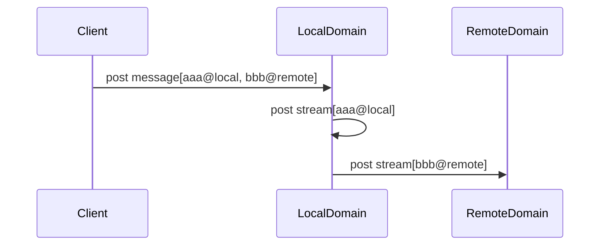
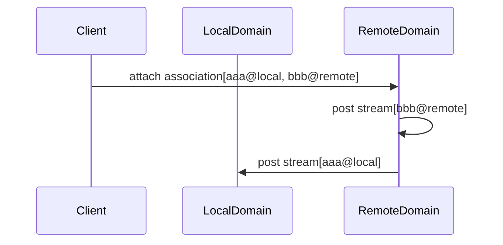
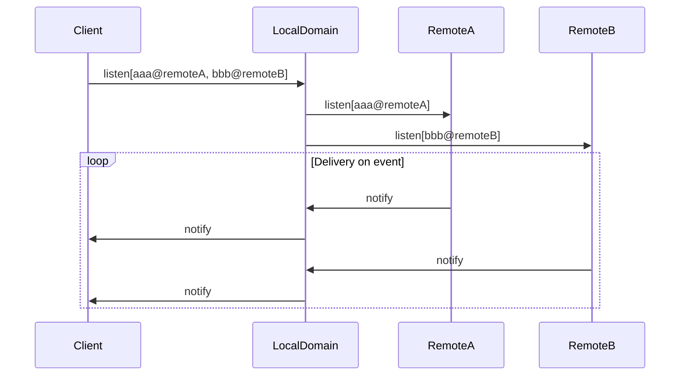

+++
title="Walkthrough"
weight=1
+++

## 現住所とリモートドメイン

コンカレントは分散型のSNSです

分散システムのデータの持ち方は、
1. 全部のノードが同じ情報を持ちシンクする方式(ブロックチェーンなどがそうですね)
2. ノードがそれぞれ別の情報を持ち、特定の情報が欲しい場合は特定ノードに直接聞く方式
3. その中間(winnyなどのp2pファイル共有)

がありますが、コンカレは2に該当します。

これにより、「自分のデータがどこにあるのか」が明確になるので、データの削除が比較的容易になります(キャッシュや魚拓により削除が思うようにいかないケースは当然あります。)

ユーザーはコンカレントで自分の投稿を公開するに際し、そのデータの保管・配信を行ってくれるノード(コンカレではドメインと呼ぶ)を1つ選びます。ドメインは、そのユーザーのデータを持っていることを advertiseします。

ユーザーがドメインを引っ越したい場合も、引越し先で再度 advertise を行うだけで可能です。

あるユーザーが現在データを設置しているサーバーを「現住所」と呼びます。

## エンティティ

ドメインに(一時的にでも)所属し、メッセージなどを発信する存在をエンティティと呼びます。

エンティティはsecp256k1の鍵をもとに、EIP-55によって生成されたアドレス (e.g. CCb72AAc9dcF088F7088b6718BE5a494fBB3861439) で表現されます。

エンティティは自身の発信する情報に秘密鍵による電子署名を施すことで、その正当性を証明することができます。

## メッセージとストリーム

エンティティはメッセージを署名つきで発行し、現住所サーバーに保存します。
メッセージのIDはサーバーではなくそのエンティティの持ち物であるため、グローバルには次のように表現できます。

```js
メッセージのID @ エンティティのID
52f54e82-faea-43c9-8f54-327911b3e6ad @ CCb72AAc9dcF088F7088b6718BE5a494fBB3861439
```

しかし、作っただけだと配布方法がない(他の人に見てもらえない)ので、特定のタイムライン(ストリーム)に投稿する必要があります。
ストリームはドメイン所有のオブジェクトであるため、グローバルには次のように表現できます。

```js
ストリームのID @ ドメインのID
ci8qvhep9dcpltmfq3fg@hub.concurrent.world
```

メッセージをストリームに投稿するには、メッセージ作成時に配信先ストリームの一覧を指定して作成します。すると、ドメインが指定のメッセージに配送を行ってくれます。
現住所ドメイン以外のドメインを指定すると、外部に配送されます。




実際のメッセージはこのようなデータになっていることが確認できます。
```js
[totegamma@16:08]~$ curl -s https://dev.concurrent.world/api/v1/message/52f54e82-faea-43c9-8f54-327911b3e6ad | jq
{
  "id": "52f54e82-faea-43c9-8f54-327911b3e6ad",
  "author": "CCb72AAc9dcF088F7088b6718BE5a494fBB3861439",
  "schema": "https://raw.githubusercontent.com/totegamma/concurrent-schemas/master/messages/note/0.0.1.json",
  "payload": "{\"signer\":\"CCb72AAc9dcF088F7088b6718BE5a494fBB3861439\",\"type\":\"Message\",\"schema\":\"https://raw.githubusercontent.com/totegamma/concurrent-schemas/master/messages/note/0.0.1.json\",\"body\":{\"body\":\"ごはんどうしよ～～～\",\"emojis\":{},\"profileOverride\":{}},\"meta\":{\"client\":\"develop.dqv3bovj4nar0.amplifyapp.com-develop-5646c76\"},\"signedAt\":\"2023-11-18T06:36:50.697Z\"}",
  "signature": "50d4c5dfc47ac2bd33e7b4545322edd2b5e51c25e244c26bcf213af5ab1feadb0fc948dedcfa6fbd420ce4979444cbc989fd5956ed322d7fe31d573826168ea600",
  "cdate": "2023-11-18T06:36:50.697Z",
  "streams": [
    "ci8qvhep9dcpltmfq3fg@hub.concurrent.world",
    "chrmqomp9dcl7anfkg90@dev.concurrent.world"
  ]
}
[totegamma@16:09]~$
```

タイムラインをを読む時は読みたいストリームを複数指定してクエリすると合算して返してくれます。

```js
[totegamma@16:12]~$ curl -s 'https://dev.concurrent.world/api/v1/streams/recent?streams=ci8qvhep9dcpltmfq3fg@hub.concurrent.world,chrmqomp9dcl7anfkg90@dev.concurrent.world' | jq
[
  {
    "type": "message",
    "objectID": "52f54e82-faea-43c9-8f54-327911b3e6ad",
    "streamID": "ci8qvhep9dcpltmfq3fg",
    "owner": "CCb72AAc9dcF088F7088b6718BE5a494fBB3861439",
    "author": "                                          ",
    "cdate": "2023-11-18T06:36:51.087084Z"
  },
  {
    "type": "message",
    "objectID": "322f3121-aa86-4368-8c72-447b060f60ee",
    "streamID": "ci8qvhep9dcpltmfq3fg",
    "owner": "CCb72AAc9dcF088F7088b6718BE5a494fBB3861439",
    "author": "                                          ",
    "cdate": "2023-11-18T06:00:07.702648Z"
  },
  {
    "type": "message",
    "objectID": "127b7cf3-36fc-462c-9886-f798c8f2f7d3",
    "streamID": "ci8qvhep9dcpltmfq3fg",
    "owner": "CC9C92A9d17Fc2cCd00FD85E190f58F35aE7dE138b",
    "author": "                                          ",
    "cdate": "2023-11-18T03:59:09.450882Z"
  },
  ...
```

データを見てみると、ストリームにはメッセージそのもののコピーではなく、メッセージ本体への参照しか保存されていないことが分かります。

## 関連付け(Association)

メッセージにいいねしたり、リプライしたりしたいですよね。

これは特定のメッセージに対する「関連付け」を作成することで実現できます。

例えば絵文字リアクションは次のような

```js
[totegamma@16:17].../git/concurrent-square$ curl -s 'https://dev.concurrent.world/api/v1/association/ae869bd0-f891-4e9e-8bde-ca7a4ffb9981' | jq '.association.payload | fromjson | .body'
{
  "shortcode": "resonyance",
  "imageUrl": "https://waon.me/emoji/resonyance.webp"
}
[totegamma@16:17].../git/concurrent-square$
```

返信だと次のような

```js
[totegamma@16:20].../git/concurrent-square$ curl -s 'https://dev.concurrent.world/api/v1/association/fbddd631-adb9-42a4-8dbd-c93637f1f5c3' | jq '.association.payload | fromjson | .body'
{
  "messageId": "2cf5ffa8-a609-4aaa-aea1-e89bbf3f1d9f",
  "messageAuthor": "CCb72AAc9dcF088F7088b6718BE5a494fBB3861439"
}
[totegamma@16:20].../git/concurrent-square$
```

内容の関連付けを、メッセージに付与することで実現できます。

注意点として、関連付けの作者(author)はユーザー自身だが、持ち主(owner)は付与した先のメッセージの作者であることに注意されたい。
つまり、すべての関連付けというのはメッセージの作者へのプレゼントだという思想で設計されています。

関連付けは自分の現住所ではなく、メッセージのあるドメインに直接送信します。

また、AssociationもStreamに入れることができます。(入れられたStreamは、例えばTwitterで言うところのいいね欄にできますね。)

例えばいいねをする時に、相手の通知streamと自分のいいねstreamを指定します。(あえて外せばサイレントでいいねできるし、自分のいいね欄を汎用のものではなく裏いいね欄みたいなものへ付け替えることもできます。)

streamへの配信はmessageと同様のロジックで実現されます。



## リアルタイムイベント配送

コンカレントはリアルタイムをサポートしています。

メッセージが作成/削除された・アソシエーションが作られた等のイベントが発生した際に、それを配信します。

(今のところ)すべてのイベントはストリームに基づいています。

例えば、streamAに配信されたメッセージにリアクションがついたというイベントは、streamBだけを購読しているユーザーにとっては要らない情報です。

イベントを所得するには現住所のsocketエンドポイントにwebsocketを繋ぎ、購読リクエストを送信します。

```js
[totegamma@16:29].../git/concurrent-square$ wscat -c https://dev.concurrent.world/api/v1/socket
Connected (press CTRL+C to quit)
> {"type":"listen","channels":["chrmsiep9dcl7anfkgd0@dev.concurrent.world"]}
```

例えば購読先のストリームでメッセージが配信されると、次のようなメッセージが送られてきます。

```js
< {
    "stream": "chrmsiep9dcl7anfkgd0@dev.concurrent.world",
    "type": "message",
    "action": "create",
    "item": {
      "type": "message",
      "objectID": "ca6c425e-52d8-4bd9-b2ee-346a8a4c58f6",
      "streamID": "chrmsiep9dcl7anfkgd0",
      "owner": "CCb72AAc9dcF088F7088b6718BE5a494fBB3861439",
      "cdate": "2023-11-18T07:30:23.312718Z"
    },
    "body": {
      "id": "ca6c425e-52d8-4bd9-b2ee-346a8a4c58f6",
      "author": "CCb72AAc9dcF088F7088b6718BE5a494fBB3861439",
      "schema": "https://raw.githubusercontent.com/totegamma/concurrent-schemas/master/messages/note/0.0.1.json",
      "payload": "{\"signer\":\"CCb72AAc9dcF088F7088b6718BE5a494fBB3861439\",\"type\":\"Message\",\"schema\":\"https://raw.githubusercontent.com/totegamma/concurrent-schemas/master/messages/note/0.0.1.json\",\"body\":{\"body\":\"てすと\",\"emojis\":{},\"profileOverride\":{}},\"meta\":{\"client\":\"develop.dqv3bovj4nar0.amplifyapp.com-develop-5646c76\"},\"signedAt\":\"2023-11-18T07:30:23.325Z\"}",
      "signature": "a60d15951b69fb3886ceda1b460d08b06336236311866e58df1396e94cdd9cf070f00a6baeef6af9b8a23760b9a1284eee80b7f343fb646c8ecc3ff4c598ebbb01",
      "cdate": "2023-11-18T07:30:23.325Z",
      "streams": [
        "chrmsiep9dcl7anfkgd0@dev.concurrent.world"
      ]
    }
  }
>
```

購読先ストリームを変更するには、再度購読したいストリームの一覧を送信するだけです。

現住所ではないドメインのストリームであっても、全てまとめて現住所のドメインにリクエストできます。

すると、ドメインが必要な外部ドメインを購読してプロキシしてくれます。



## キャラクター

キャラクターはあるEntityの名前やアイコンを始め、特定用途のstreamなどを公表するものです。

これによりメインのプロフィールだけでなく、例えばゲーム用のプロフィール、特定アニメのファンとしてのプロフィールなど、様々なプロフィールを作成し公開できます。

```js
[totegamma@16:28].../git/concurrent-square$ curl -s 'https://dev.concurrent.world/api/v1/characters?author=CCb72AAc9dcF088F7088b6718BE5a494fBB3861439&schema=https%3A%2F%2Fraw.githubusercontent.com%2Ftotegamma%2Fconcurrent-schemas%2Fmaster%2Fcharacters%2Fprofile%2F0.0.2.json' | jq '.characters | map(del(.associations))'
[
  {
    "id": "2a2980cb-81cc-4b2b-8a24-fdb72efaff9e",
    "author": "CCb72AAc9dcF088F7088b6718BE5a494fBB3861439",
    "schema": "https://raw.githubusercontent.com/totegamma/concurrent-schemas/master/characters/profile/0.0.2.json",
    "payload": "{\"signer\":\"CCb72AAc9dcF088F7088b6718BE5a494fBB3861439\",\"type\":\"Character\",\"schema\":\"https://raw.githubusercontent.com/totegamma/concurrent-schemas/master/characters/profile/0.0.2.json\",\"body\":{\"username\":\"ととがんま\",\"description\":\"きつねエンジニアリング\",\"avatar\":\"https://s3.gammalab.net/profile/tote-icon.png\",\"banner\":\"https://s3.gammalab.net/profile/header.png\"},\"meta\":{\"client\":\"develop.dqv3bovj4nar0.amplifyapp.com-develop-4ed0085\"},\"signedAt\":\"2023-11-16T02:18:49.455Z\"}",
    "signature": "698f8615015d13abfa63ce4b698411500119c512aa33691121cf0d4e43cf885d361e689bdcda9417e4d28a32ffb7d2e8b15131ae267b72becb410f39f168fc0000",
    "cdate": "0001-01-01T00:01:58Z",
    "mdate": "2023-11-16T02:18:49.492129Z"
  }
]
[totegamma@16:28].../git/concurrent-square$
```

